# Deploying a Cartesi dApp 

## First experiment with Sunodo

We first deployed an example Cartesi dApp called [Echo Python](https://docs.cartesi.io/cartesi-rollups/0.8/build-dapps/run-dapp/) by using Cartesi's [Sunodo framework](https://docs.sunodo.io/). However, Sunodo only provided Anvil integration (local blockchain) and was not suitable for our requirements.

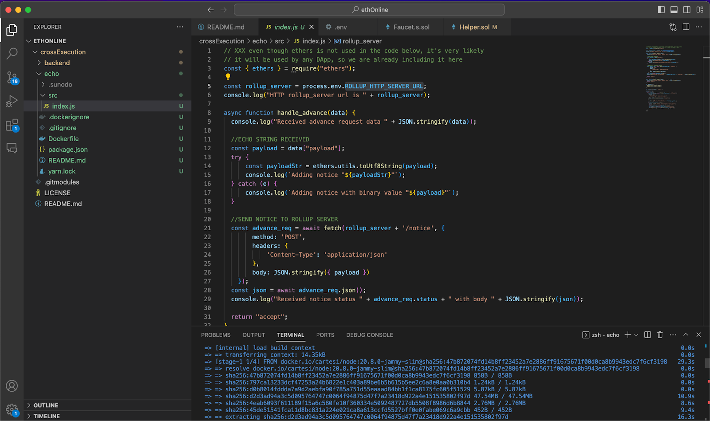

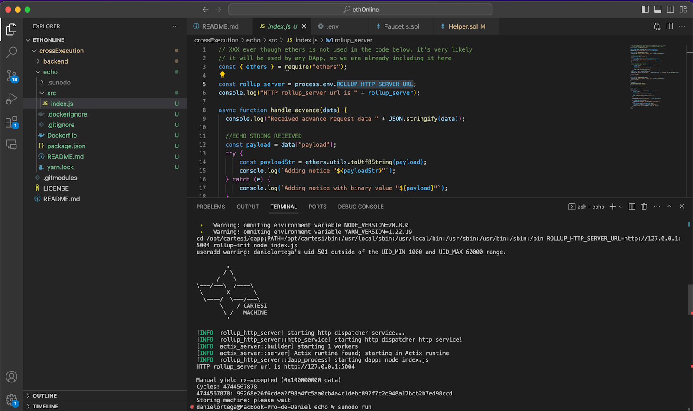

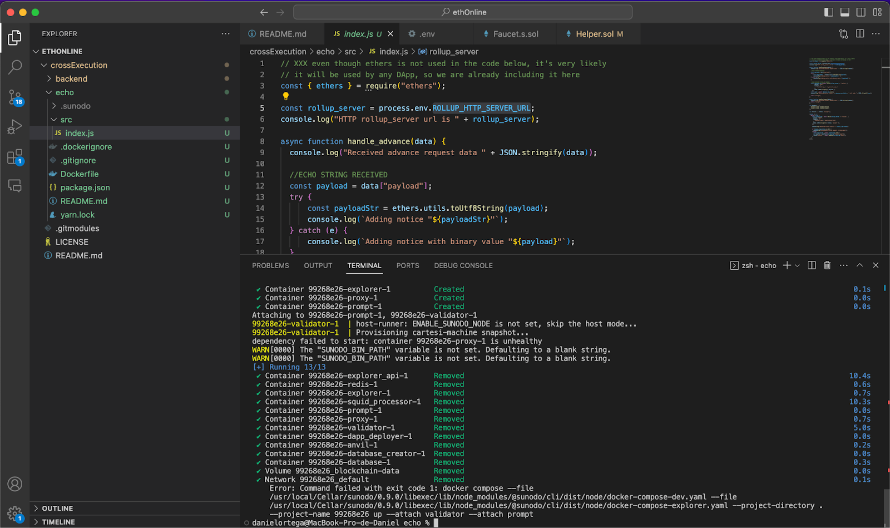

As we don’t have enough working examples provided by Sunodo (that will ensure that it will work and potentially it seems that we’ll need to set a Validator and pay for it), we’re going to use [rollups-examples](https://github.com/cartesi/rollups-examples) and clone the Echo dApp from there.

## Building an echo dApp from Cartesi Rollups examples

1. Clone the [cartesi/rollups-examples](https://github.com/cartesi/rollups-examples) Github repository, and `cd` into it:

```shell
git clone https://github.com/cartesi/rollups-examples.git
cd rollups-examples
```

2. Navigate to the dApp example directory by running the following command:

```shell
cd echo-python
```

3. Build the Echo DApp:
```shell
docker buildx bake --load
```


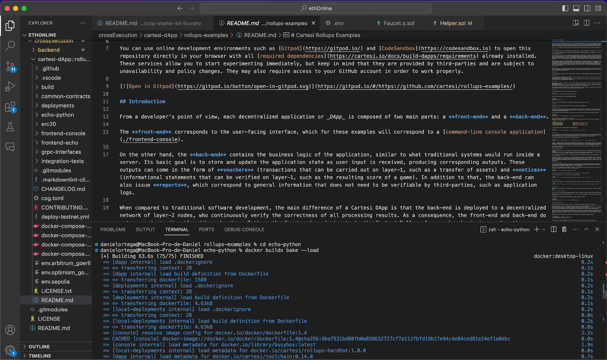

## Running the Cartesi dApp


To run the application, we start an environment that includes a local blockchain with the Cartesi smart contracts deployed, as well as a Cartesi layer-2 node executing the DApp's back-end logic.


```shell
docker compose -f ../docker-compose.yml -f ./docker-compose.override.yml up
```

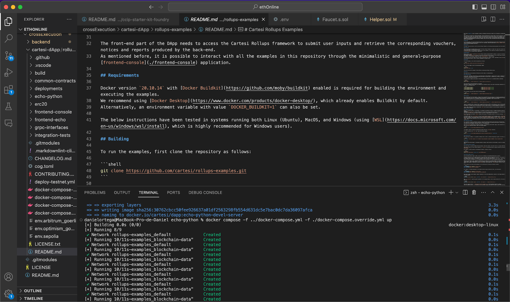


### Frontend-console application

With the infrastructure in place, we can use the [frontend-console application](https://github.com/cartesi/rollups-examples/tree/main/frontend-console) to interact with the Echo dApp.

Every Rollups dApp gets an address on the base layer when it's deployed. The following is needed to send inputs to a DApp:

* Gateway URL to the intended chain
* Cartesi Rollups InputBox contract address
* Appropriate account with sufficient funds for submitting transactions to the network

### Interacting with the dApp locally 

The following steps describe how to send an input to the Echo DApp instance that is running locally:

1. Open a separate terminal window
2. From the rollups-examples base directory, navigate to the `frontend-console` one:

```shell
cd frontend-console
```

3. Build the frontend console application:

```shell
yarn
yarn build
```

4. Send an input to the current locally deployed DApp:

```shell
yarn start input send --payload "hi there!"
```


5. Verify the outputs (notices) generated by your input:

```shell
yarn start notice list
```

After completing all the steps above, we get a response with the payload of the notice:

`"hi there!"`

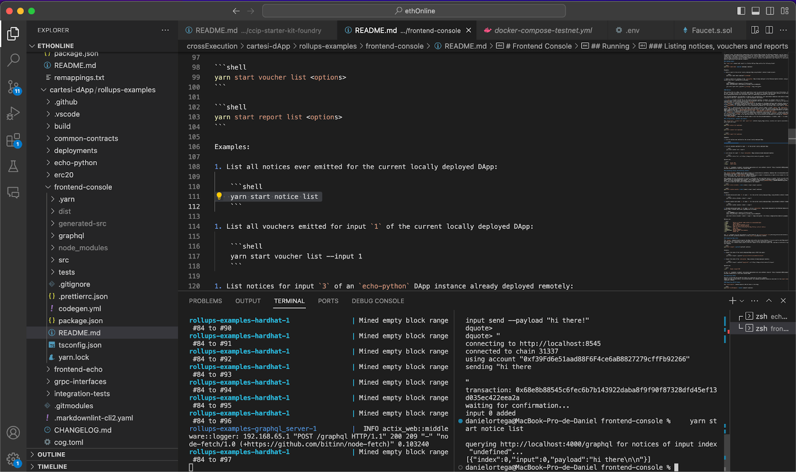

### Deploying the dApp to Sepolia

1. We run:

```shell
DAPP_NAME=echo-dlinn docker compose --env-file ../env.sepolia -f ../deploy-testnet.yml up
```

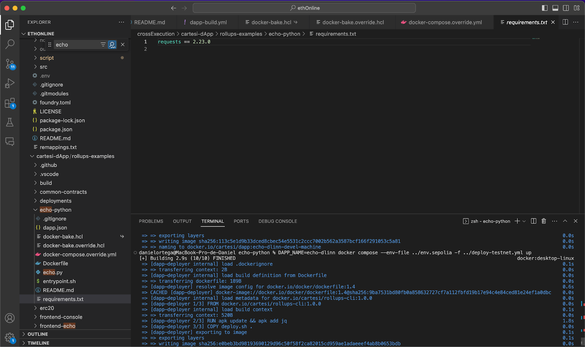
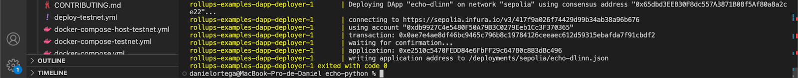
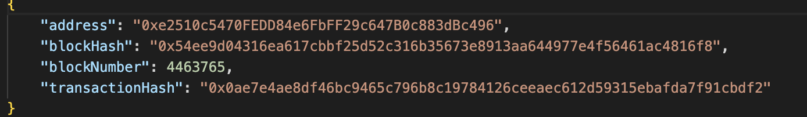

2. We then run the validator node.

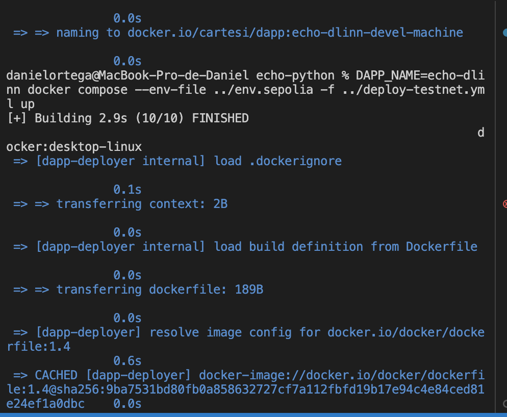

3. Once the validator node is running, we interact with it via the Front-end console.

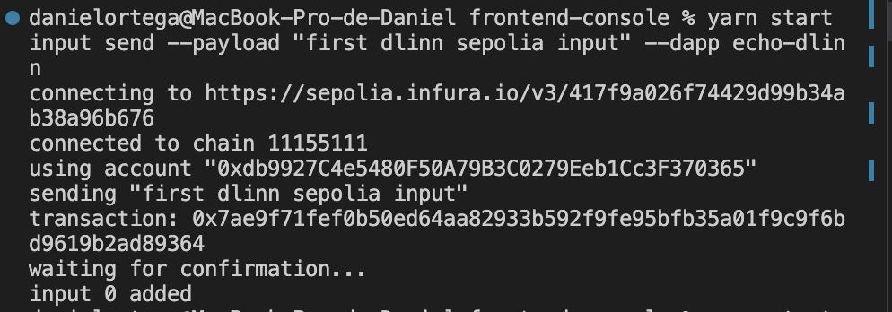
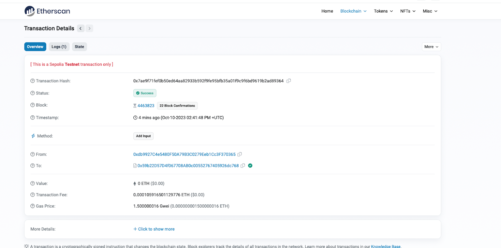

### Interacting with the dApp to Sepolia

1. To interact with the dApp on Sepolia, we need to adjust the Front-end console by switching `localhost` to `sepolia` in the `.env` files.

:::note
We may need to deploy custom graphql for querying information. We try to add input information without crosschain, frontend -> Cartesi dAPP and see if information is queried.
:::

2. Now we can send an input as follows:

```shell
yarn start input send --payload "test 1946" --rpc https://sepolia.infura.io/v3/417f9a026f74429d99b34ab38a96b676 --dapp echo-dlinn
```


