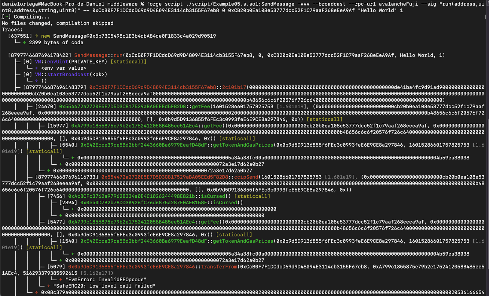

#  Deploy a contract for CCIP and Cartesi dApp

We deploy an Ethereum Smart Contract that implements `CCIPReceiver.sol` interface and forwards information to the Cartesi Echo dApp.

## First deployment

In our first deployment, we used the following data:

* Sepolia InputBox = 0x59b22D57D4f067708AB0c00552767405926dc768
* Sepolia Relayer = 0xCB20b0Ea108e53777dcc52F1C79aaF268eEeA9Af
* Avax Sender = 0xCcB0F7F1DCdcD69d9D48094E3114cb3155F67eb8
* Wss for validator=wss://sepolia.infura.io/ws/v3/417f9a026f74429d99b34ab38a96b676
* Rpc = https://sepolia.infura.io/v3/417f9a026f74429d99b34ab38a96b676

We get an error that might appaer because we don’t have enough balance in Avax sender, or in Sepolia relayer. To solve this, we add funds with avax sender (.1 AVAX) and send the transaction paid with the native coin, not LINK.



## Second deployment

In our second deployment we use:

* Relayer deployed at:

```shell
0xc690DBb7c8BaeEE9039a2F7c1fb1E881bdcF738C
0x0f34DD596F2EdA21e2cEa551c80e31178ee62Bd0
0x543827f99405cCAf09Bd8993e1f47d6382C0747e
0xD0a5Aa8D099B9B6F5Ac619c9aC363443DFfF13e3
0x501acCDbC057338E5A75aA4b4BaB795830D232de
```

* New deploy command:

```shell
forge script ./script/DeployCrosschainrelayer.s.sol:DeployCrossChainRelayer -vvv --broadcast --rpc-url ethereumSepolia --sig "run(uint8, address, address)" -- 0 0x59b22D57D4f067708AB0c00552767405926dc768 0xe2510c5470FEDD84e6FbFF29c647B0c883dBc496

0x98fcf378FdB37a9615014E91772EF9d921697ED2
```

* Sender deployed at:

```shell
0xCcB0F7F1DCdcD69d9D48094E3114cb3155F67eb8
0x6D1105f424dC488DB39A151CF78bd3296a786b95
0x2F89874C7CdD48DFC56F48a21E255a66804E85Eb
```

* Sending an input:

```shell
cast send 0xCcB0F7F1DCdcD69d9D48094E3114cb3155F67eb8 --rpc-url avalancheFuji --private-key=<> --value 0.1ether
```

```shell
cast send 0x0b9d5D9136855f6FEc3c0993feE6E9CE8a297846 "transfer(address,uint256)" 0xCcB0F7F1DCdcD69d9D48094E3114cb3155F67eb8 10000000000000000 --rpc-url avalancheFuji --private-key=<>
```

