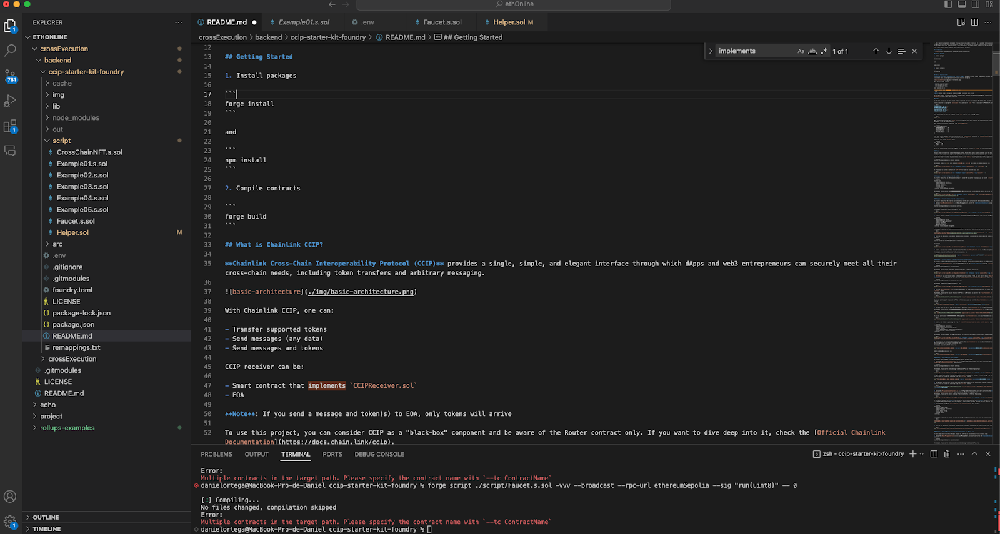
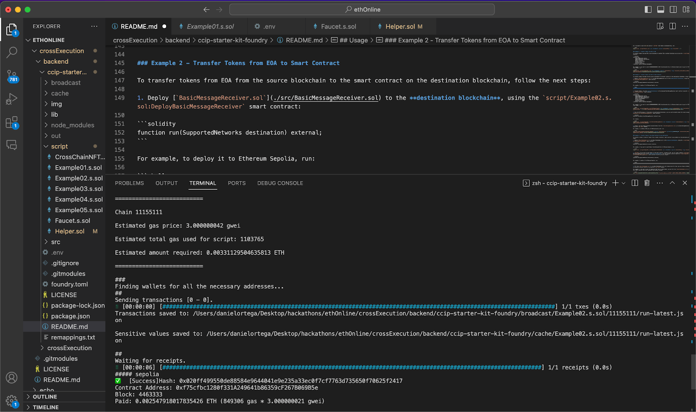
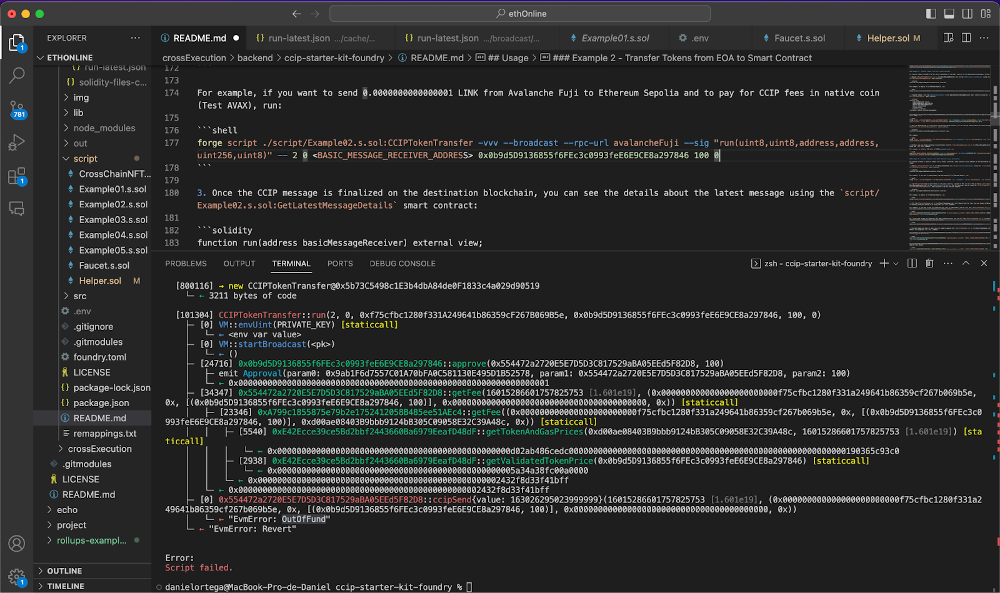

# Create a basic Ethereum dApp

As the first step of LNX development, we create a simple Ethereum dApp that receives messages from [Avalanche](https://www.avax.network/) and implements [CCIP from Chainlink](https://chain.link/cross-chain).

1. Clone [CCIP Starter kit repository](https://github.com/smartcontractkit/ccip-starter-kit-foundry).



2. Install packages:

```shell
forge install
npm install
```
3. Compile contracts:

```shell
forge build
```


4. Use infura RPC endpoint to have access to different blockchains.
3. Deploy the smart contract to Ethereum Sepolia.



Here we see the deployment of the Relayer in Ethereum. In the example below, we do not have enough funds in Avalance to send to Ethereum:

