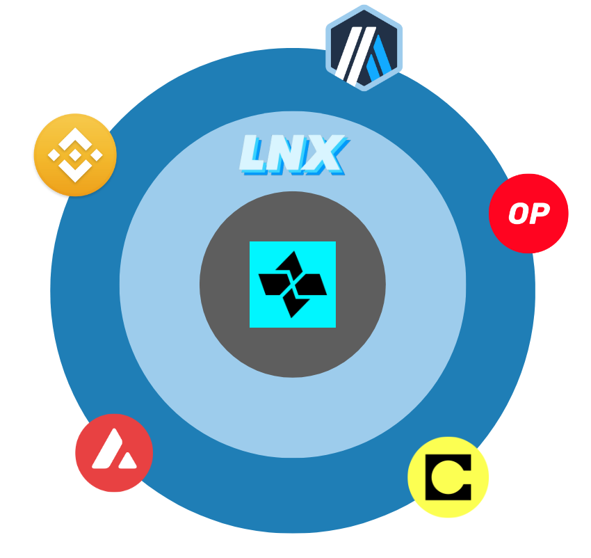

# What is LNX

LNX is an innovative project that introduces a groundbreaking solution for deploying [Cartesi-powered](https://cartesi.io/) Linux  decentralized applications (dApps) across all the blockchain ecosystem. This project enables cross-chain communication, allowing computer-demanding dApps to seamlessly function on different blockchains.

LNX harnesses the robust capabilities of [Cartesi](https://cartesi.io/), a versatile app-specific scaling solution, to enable Linux runtime dApps across different blockchains, taking interoperability to a new level. The project addresses a critical challenge within the blockchain ecosystem by offering a solution that breaks the limitations of being confined to a single blockchain. These limitations encompass issues such as liquidity bottlenecks, restricted user bases, constrained community engagement, security and privacy concerns, alongside technical and operational challenges. LNX's cross-chain capabilities provide the flexibility to adapt, scale, and engage with diverse user communities across multiple blockchains while safeguarding against the rigidity of a single-chain approach, ensuring the longevity and versatility of dApps in an ever-evolving blockchain landscape.